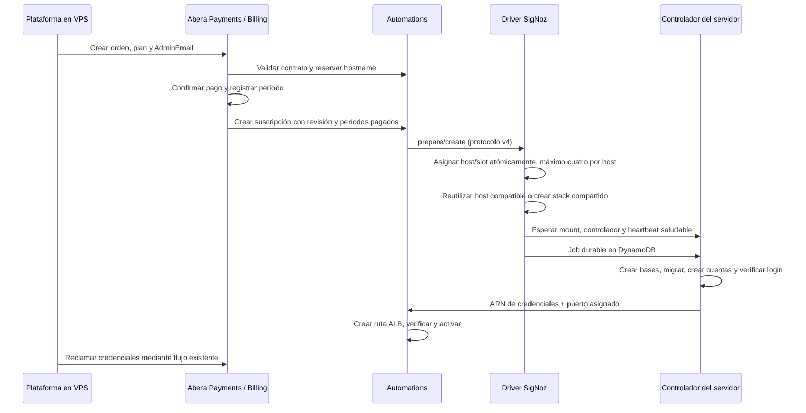

# Arquitectura y contratos

## Flujo comercial

La release 0.2.0 conserva `usagePolicy` prepagado y la reserva estándar de hostname. El límite global de `capacityPolicy` de 0.1.0 se sustituye por el asignador privado del producto en Automations: cuatro slots por host. Billing conserva su API y envía los períodos pagados; CREATE/RECOVER asignan infraestructura después de esa petición. ARCHIVE/DELETE liberan el slot después de la confirmación de eliminación del cliente. Una suspensión conserva la asignación. No se crean servidores al publicar la release ni al reservar una orden sin pago.

El driver Lambda coordina asignación, CloudFormation, jobs por host y retirada. Cada controlador ejecuta su propia cola, mantiene su lease y comprueba grupo, slot, cliente, propietario y plazo de la operación. La asignación exige imágenes compartidas y template compatibles; una compra simultánea converge en el mismo grupo y un reintento conserva su slot. Las renovaciones de una suscripción activa actualizan el contexto de Billing sin desplegar infraestructura; el controlador lee ese contexto y reconcilia los límites.

## Aislamiento

- Una aplicación Community y SQLite por cliente; no se depende de la multitenencia Enterprise.
- Siete bases posibles con prefijo aleatorio derivado de suscripción y generación. El código resuelve nombres conocidos al iniciar; no reescribe SQL introducido por el usuario.
- Usuarios separados para lectura, exportación y consultas distribuidas. Los engines Distributed guardan el clúster del cliente, nunca credenciales de migración.
- El administrador de ClickHouse solo se usa desde el operador y el contenedor temporal de migración. Aplicaciones y colectores carecen de DDL y de permisos sobre las bases de otros clientes.
- Redes privadas por cliente. ClickHouse y Keeper no publican puertos. AWS permite llegar a los cuatro gateways solo desde el ALB compartido. IMDSv2 tiene hop limit 1; el controlador usa la red del host.
- SQL libre, registro público inicial y cambios de TTL se rechazan en el gateway. Se conserva el constructor de consultas de SigNoz y el cliente recibe una cuenta administradora no raíz.

Las pruebas comprueban SELECT propio y cruzado, tokens ajenos, DDL, lectura de usuarios, Keeper y archivos. El proceso ClickHouse y el sistema operativo siguen siendo componentes compartidos: todavía se necesita una prueba adversarial de consumo de recursos antes de aceptar clientes.

## Entrega y consumo

El gateway valida la identidad y el período pagado, decodifica OTLP y registra consumo, recibo y carga útil en **una transacción SQLite durable** antes de responder. Los límites de bytes, puntos, series, velocidad y cola se verifican de forma atómica. Reintentos idénticos dentro del mismo período se deduplican durante 24 horas. El cambio de plan conserva los contadores.

La cola tiene 32 MiB y el archivo SQLite un máximo de 256 MiB. El colector escribe sin cola ni batching volátiles. Un ACK del exportador sigue a la escritura en ClickHouse. Un fallo 5xx provoca reintento; un rechazo permanente o éxito parcial queda en cuarentena y aparece en el panel para revisión. **La entrega al almacén puede duplicarse si se pierde la respuesta después de insertar**; el consumo del gateway no se vuelve a cobrar. No se afirma entrega exactamente una vez.

El disco se observa cada 25 segundos en AWS; una lectura vieja o menos de 15 %/5 GiB libres detiene ingestión. El límite por cliente mide las partes activas de ClickHouse; también existe reserva global para SQLite, imágenes, merges y backups. El tope es un control preventivo con observación periódica, no una partición de disco físicamente reservada.

## Expiración y recuperación

| Evento | Comportamiento |
| --- | --- |
| Expira el período pagado | Se detiene inmediatamente la ingestión; las consultas conservan cuatro días de gracia. |
| Suspensión | Se detienen los contenedores del cliente. Se conservan sus bases y volúmenes. |
| Día siete sin pago | Automations inicia ARCHIVE; solo elimina recursos después de registrar el backup final verificado. |
| Pago durante la ventana de recuperación | RECOVER reclama un cupo, restaura su identidad y aplica la revisión comercial vigente. |
| Fin de los 30 días desde archivo | PURGE elimina las versiones exactas indicadas por el recibo, mediante el lifecycle existente. |

Los backups detienen brevemente **al cliente respaldado**. Incluyen ClickHouse nativo, aplicación, ledger y secretos de aplicación. Antes de publicarlos se restauran temporalmente las tablas, se verifican integridad y cantidades, y se elimina la copia de verificación. Los tres artefactos se suben con KMS y se vuelven a leer para verificar SHA-256. Los recibos fijan versiones de S3; un reintento reutiliza los mismos objetos.

La restauración normal conserva los contadores, series y lotes pendientes más recientes. Una recuperación de un archivo final sellado conserva exactamente el cupo registrado. Si se pierde el servidor y solo existe un backup periódico, se bloquea conservadoramente el cupo del período activo hasta conciliación; podría existir consumo aceptado después del backup. La retención usa la fecha original de la telemetría y se vuelve a materializar al restaurar.

Se conservan dos backups periódicos por cliente; los backups operativos adicionales expiran a los 30 días. Los archivos finales tienen el plazo administrado por Automations. El controlador registra también el inventario operativo en DynamoDB; el coordinador puede purgar sus versiones vencidas aunque el host se haya retirado. KMS, S3, imágenes y driver permanecen disponibles para la recuperación. Una copia local de restauración incompleta bloquea la retirada hasta su inspección.

## Actualizaciones y crecimiento

App y colector tienen digests por cliente. UPDATE toma backup, despliega y migra ese cliente durante `verify`, comprueba salud y luego permite activar la ruta. Los digests de ClickHouse/Keeper compartidos no pueden cambiar mediante UPDATE de una suscripción. Un fallo de recuperación o migración deja el cliente detenido para inspección.

El quinto cliente crea otro grupo de hasta cuatro. Se reutilizan cupos libres y se retiran grupos vacíos; no se mueven clientes activos entre hosts para compactar capacidad. El último ARCHIVE/DELETE inicia la retirada, y un evento cada cinco minutos avanza sus pasos. RETIRING bloquea nuevas asignaciones; un contador cero necesita además una prueba del controlador sobre bases, Docker volumes y backups pendientes. CloudFormation elimina la máquina, el root efímero y el attachment. El driver borra el EBS de datos retenido solo después de confirmar identidad, tags y ausencia de attachments, y comprueba su desaparición antes de marcar RETIRED.

Una creación AWS con resultado desconocido o un host averiado se conserva como estado pendiente para inspección; no autoriza borrar datos. El disco legado importado en la foundation no pertenece a ningún grupo nuevo y queda fuera de este retiro automático. El costo de cada host nuevo se suma al escenario; COP 450.000 sigue siendo el techo del escenario inicial, no un techo global demostrado para varios hosts. La actualización del controlador o del motor compartido exige considerar todos los clientes del host revisado.
